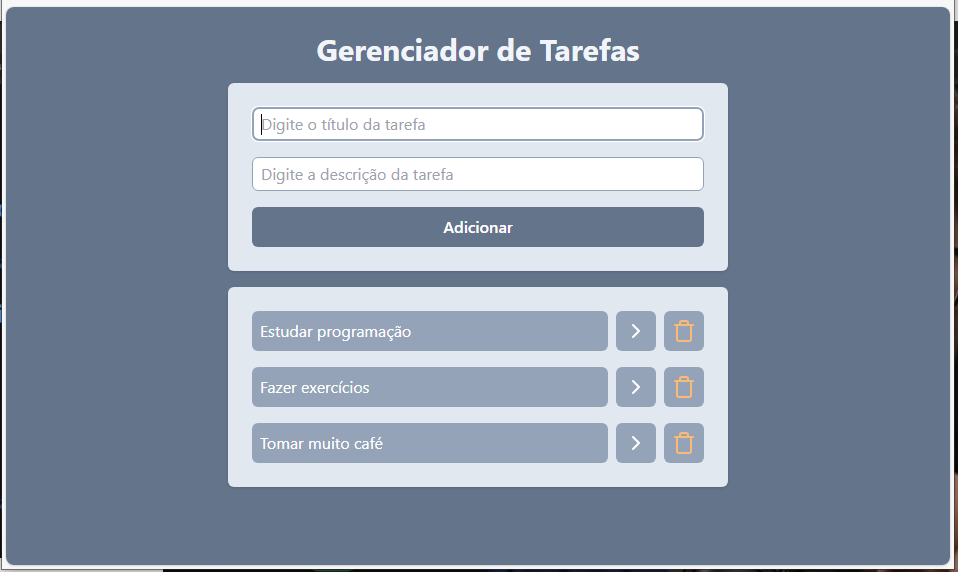

# TaskManager React



Projeto baseado em [React](https://react.dev/) para gerenciar uma lista de atividades, baseado no workshop **Full Stack Week** da Full Stack Club.

Foram explorados os conceitos de modularização e roteamento do React, consulta a API e persistência das tarefas no *localStorage* do navegador, e customização do front-end com [Tailwindcss](https://r.search.yahoo.com/_ylt=Awriqu71fMNnFwIACKjz6Qt.;_ylu=Y29sbwNiZjEEcG9zAzEEdnRpZAMEc2VjA3Ny/RV=2/RE=1742074357/RO=10/RU=https%3a%2f%2ftailwindcss.com%2f/RK=2/RS=_OgqEZ7ssCh9JJ3KhjMX7xcNyQY-) e dependências, e cria os templates.

Funcionaldades Básicas

- Criar nova Tarefa
- Marcar/desmarcar a tarefa como executada
- Excluir uma tarefa
- Visualizar detalhes da tarefa
- Dados persistidos localmente no navegador


# Para executar este projeto:

0. Instalar o [node.js](https://nodejs.org) se necessário

1. Abrir o terminal e executar os comandos abaixo:

```shell
git clone https://github.com/gtnasser/tasklist-react.git
cd tasklist-react
npm install
npm run ev
```

2. Abrir o browser em http://localhost:5173/

OU acesse a [Live Demo](https://tasklist-react-alpha.vercel.app/) publicada no [Vercel](https://vercel.com/)


# Acompanhando o desenvolvimento - Primeiros passos

### criar projeto [React](https://react.dev/) usando o [Vite](https://vite.dev/guide/)

```shell
$ npm create vite@5.5.2 .
  REACT
  Javascript
$ npm install
```

### instalar router
```shell
$ npm install react-router@6.26.1
```

### instalar o [Tailwindcss](https://r.search.yahoo.com/_ylt=Awriqu71fMNnFwIACKjz6Qt.;_ylu=Y29sbwNiZjEEcG9zAzEEdnRpZAMEc2VjA3Ny/RV=2/RE=1742074357/RO=10/RU=https%3a%2f%2ftailwindcss.com%2f/RK=2/RS=_OgqEZ7ssCh9JJ3KhjMX7xcNyQY-) e dependências, e cria os templates

```shell
$ npm install -D tailwindcss@3.4.10 postcss@8.4.41 autoprefixer@10.4.20
$ npx tailwindcss init -p
```

tailwind.config.js:
```js
/** @type {import('tailwindcss').Config} */
export default {
  content: ["./src/**/*.{html,js,jsx,ts,tsx}"],
  theme: {
    extend: {},
  },
  plugins: [],
}
```

index.css:
```css
@tailwind base;
@tailwind components;
@tailwind utilities;
```

### carregar icones

```shell
$ npm install lucide-react@0.435.0
```

### carregar gerador de id único

```shell
$ npm install uuid@10.0.0
```

### iniciar o repositório

```shell
$ echo "# todolist-react" >> README.md
$ git init
$ git add .
$ git commit -m "first commit"
```

### criar componentes básicos

```
$ mkdir src/components
```

Tasks.jsx:
```jsx
function Tasks() {
    return (
        <h1>Tasks</h1>
    )
}
export default Tasks
```

AddTasks.jsx:
```jsx
function AddTask() {
    return (
        <h1>Add Task</h1>
    )
}
export default AddTask
```

App.css:
```css
```

App.jsx:
```js
import Tasks from './components/Tasks.jsx'
import AddTask from './components/AddTask.jsx'
import { SmilePlus } from "lucide-react"
function App() {
    return (
        <div>
            <h1 className="text-red-500"><SmilePlus />Gerenciador de Tarefas</h1>
            <AddTask />
            <Tasks />
        </div>
    )
}
export default App
```

verificar estilos e ícones

```shell
$ npm run dev
```

### próximos passos: desenvolver funcionalidades

- persistir a lista de tarefas e mostrar naa tela
- trocar status (pendente/finalizada)
- excluir tarefa
- incluir nova tarefa
- consultar detalhe da tarefa
- persistir dados no browser

### Deploy

```shell
$ npm run build
```


